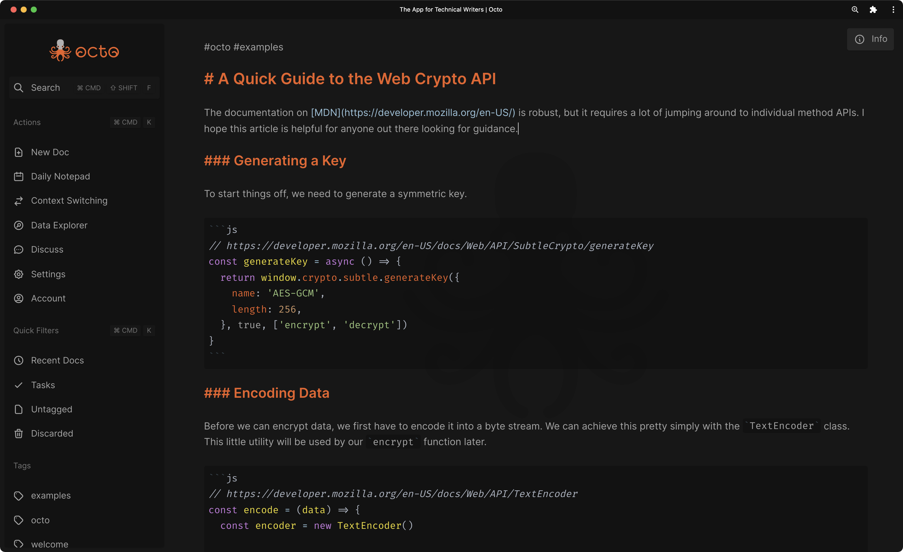

[](https://github.com/writewithocto/octo/releases)
[](https://github.com/writewithocto/octo/blob/main/LICENSE)
[](https://github.com/writewithocto/octo/issues)
[](https://github.com/writewithocto/octo/discussions)
[](https://twitter.com/writewithocto)

<p align="center">
  <a href="https://octo.app">
    
  </a>
</p>

<p align="center">A hackable, offline-first markdown editor for notes, code snippets, and writing that runs entirely in-browser.</p>

[](https://octo.app)

## Features

### Dark and Light Themes

Dark theme by default. Light theme if you want it. 😎

### Inline Markdown Rendering and Automatic Syntax Highlighting

All Markdown formatting is rendered in place. This eliminates the need for a preview pane while keeping your document in plain text. Feel free to copy and paste your Markdown into or out of this editor! Code blocks are automatically highlighted based on the tagged language.

### Client-Side Encryption

Uses a [hybrid cryptosystem](https://en.wikipedia.org/wiki/Hybrid_cryptosystem) approach to reap the benefits of both public-key and symmetric encryption.

### Keyboard Friendly and Searchable

Keyboard shortcuts are available for many actions. Search documents with plain text or regex.

### Context Switching

Focusing on `#work` or `#play`? Apply a global filter to only see the documents that are relevant in a given moment.

### Offline First and Mobile First (Responsive)

No account, server, or internet connectivity necessary (after first load). The entire app is cached in the browser using Service Workers. Documents are stored in IndexedDB. All features of the app are built for mobile and desktop. The design changes responsively based on available screen real estate.

### Modern Technologies

Built with Vue, Vuex, and VueRouter. Progressive Web Apps are accessible on all platforms and installable on many.

### Tag-based Organization

Add as many hashtags to your documents as you like. Build a network of information, and explore the patterns and connections that arise.

## Demo

[Watch a quick intro on YouTube](https://youtu.be/Brtvzu-3qT8) (1m 39s)

To try out the sandboxed app (no accounts or syncing), check out [try.octo.app](https://try.octo.app).

## Install

As simple as it gets.

```bash
# install dependencies
yarn install
```

## Local Development

Copy `.env.example` to `.env`.

```bash
cp .env.example .env
```

### Launch the Firebase Emulator

For more information about retrieving a Firebase access token, see the [docker-firebase-cli](https://github.com/voraciousdev/docker-firebase-cli) project.

```bash
docker-compose up -d
```

The Firebase Emulator dashboard is available at [localhost:32777](http://localhost:32777).

### Launch the app

Run the app in `development` mode.

```bash
# binds to localhost:8888
yarn serve_dev
```

Run the app in `production` mode (to test the PWA).

_Note: Offline functionality is only available in `production` mode due to [lack of support](https://github.com/vuejs/vue-cli/issues/2678) in the Vue PWA plugin._

```bash
# binds to localhost:8889
yarn serve_prod
```

## Compile to Static Assets

Create the production build.

```bash
# compiles at ./dist
yarn build_prod
```

The static assets will be available in the `dist` directory.

## Attributions

Logo by Zagg Studios

## Support

Your support is appreciated. Here are some ways you can help. ♥️

### Provide Feedback

Your feedback is immensely important for building octo into an app that we all love. Consider [starting a discussion](https://github.com/writewithocto/octo/discussions) if you have a question or just want to chat about ideas!

### Open a Pull Request

If you feel comfortable tackling [an existing issue](https://github.com/writewithocto/octo/issues), please consider opening a Pull Request! I am happy to introduce you to the codebase and work with you to get it merged!

### Subscribe to Octo Pro

[Octo Pro](https://octo.app/account) is the official paid subscription plan on [octo.app](https://octo.app).

### Become a Backer

- [GitHub Sponsors](https://github.com/sponsors/voraciousdev)
- [Patreon](https://patreon.com/voraciousdev)
- [Ko-Fi](https://ko-fi.com/voraciousdev)
- [Buy Me a Coffee](https://www.buymeacoffee.com/voraciousdev)
