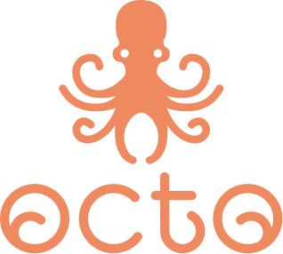
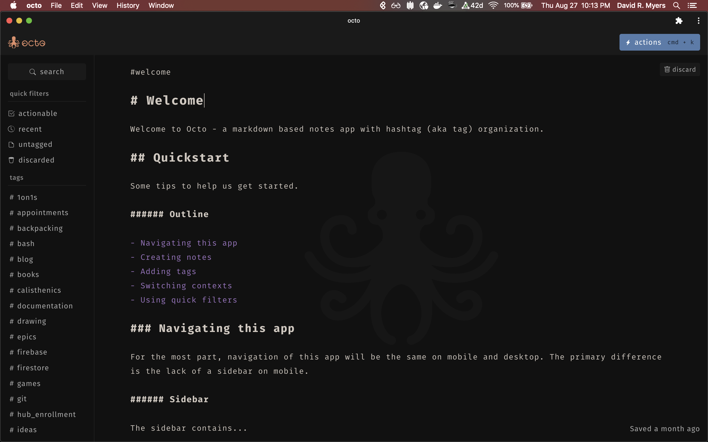

<p align="center">
  <a href="https://octo.app">
    
  </a>
</p>

<p align="center">A writing app for developers</p>

[](https://octo.app)

<p align="center">Follow <a href="https://twitter.com/voraciousdev">@voraciousdev</a> on Twitter for updates!</p>

## Features

- **Autosave** - No need to hit save
- **Client-Side Encryption** - Uses a [hybrid cryptosystem](https://en.wikipedia.org/wiki/Hybrid_cryptosystem) approach to reap the benefits of both public-key and symmetric encryption
- **CodeSandbox Integration** - Open all code blocks in the current document in a new [CodeSandbox](https://codesandbox.io/) project with the click of a button
  - Watch a quick demo [on YouTube](https://youtu.be/o3tQsqwgnY4)
- **Context Switching** - Focusing on `#work` or `#play`? Apply a global filter to only see the documents that are relevant
- **Dark Theme** - Save our eyes 😎
- **Inline Markdown Rendering** - No need for separate edit and preview panels
- **Keybindings** - Keyboard shortcuts for many actions
- **Modern Technologies** - Built with Vue, Vuex, and VueRouter
- **Offline First** - No account, server, or internet connectivity necessary (files are stored in IndexedDB, WebSQL, or LocalStorage)
- **PWA** - Progressive Web Apps are accessible on all platforms and installable on most
- **Regular Expressions** - Search our documents with plain text or regex
- **Responsive** - Use on desktop or mobile
- **Syntax Highlighting** - Code blocks are highlighted based on the tagged language
- **Tag Based Organization** - Add one or more hashtags to our documents, just like we would on Twitter (code blocks are ignored)

### Coming Soon

- **Keybinding Configuration** - Use the shortcuts that make sense to you
- **Light Theme** - Why not both?
- **Native Apps** - Install a native application on Android, iOS, or desktop (built with Ionic's [Capacitor](https://capacitorjs.com/) framework)

## Demo

To try out the sandboxed app (no accounts or syncing), check out [try.octo.app](https://try.octo.app).

## Install

As simple as it gets.

```shell
# install dependencies
npm install
```

## Local Dev

We can run it in `development` mode.

```shell
# binds to localhost:8888
npm run serve_dev
```

We can also run it in `production` mode.

_Note: Offline functionality is only available in `production` mode due to [lack of support](https://github.com/vuejs/vue-cli/issues/2678) in the Vue PWA plugin._

```shell
# binds to localhost:8889
npm run serve_prod
```

## Deploy

Create the production build.

```shell
# compiles at ./dist
npm run build_prod
```

The static assets will be available in the `dist` directory.

## Attributions

Logo by [Zagg Studios](https://zaggstudios.com/)

## Support

Your support is appreciated. ♥️

### Provide Feedback

Your feedback is immensely important for building octo into an app that we all love. Consider [opening an issue](https://github.com/voraciousdev/octo/issues) if you discover any bugs or just want to chat about ideas!

### Open a Pull Request

If you feel comfortable tackling [an existing issue](https://github.com/voraciousdev/octo/issues), please consider opening a Pull Request! I am happy to introduce you to the codebase and work with you to get it merged!

### Donate

Donations help support the development of octo (this open source project) and the hosting of [octo.app](https://octo.app).

Accounts on [octo.app](https://octo.app) include syncing and persistence through Firebase. Accounts are currently free, and your financial support directly impacts how long we can keep it that way.

- [Buy Me a Coffee](https://www.buymeacoffee.com/voraciousdev)
- [Ko-Fi](https://ko-fi.com/voraciousdev)
