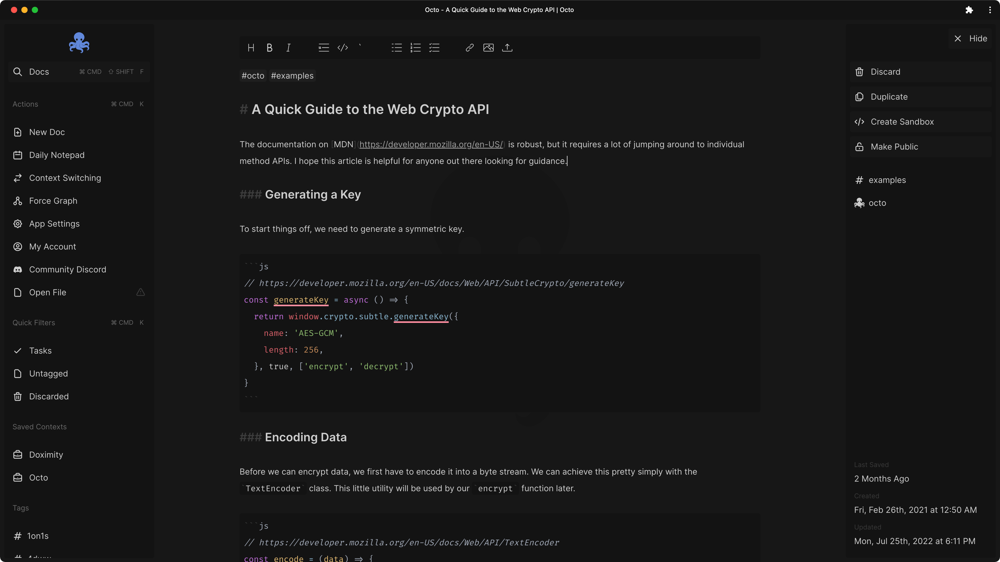

# Octo

Build your knowledge base at [octo.app](https://octo.app)

## Features

- [x] Dark and light themes
- [x] Plain-text docs with in-place styling
- [x] Syntax highlighting for many languages
- [x] Keyboard navigation and shortcuts
- [x] End-to-End Encryption (E2EE) support
- [x] Cross-platform and offline-first web app
- [x] Full-text exact match or regex search
- [x] Organize your docs with plain-text hashtags
- [x] File attachments
- [x] Context management
- [x] Optional Vim Mode editing

## Contributions

Please read the [Contributing Guide](https://github.com/voraciousdev/octo/blob/main/CONTRIBUTING.md) and the [Code of Conduct](https://voracious.link/code-of-conduct) before making a Pull Request.

## Supporting Octo

Your support is appreciated. Here are some ways you can help. ♥️

### Tell us what you think

Your feedback is immensely important for building octo into an app that we all love. Consider [starting a discussion](https://github.com/voraciousdev/octo/discussions) if you have a question or just want to chat about ideas!

### Become a financial backer

- [GitHub Sponsors](https://github.com/sponsors/voraciousdev)
- [Open Collective](https://opencollective.com/voracious)
- [Patreon](https://patreon.com/voraciousdev)
- [Ko-Fi](https://ko-fi.com/voraciousdev)
- [Buy Me a Coffee](https://www.buymeacoffee.com/voraciousdev)
