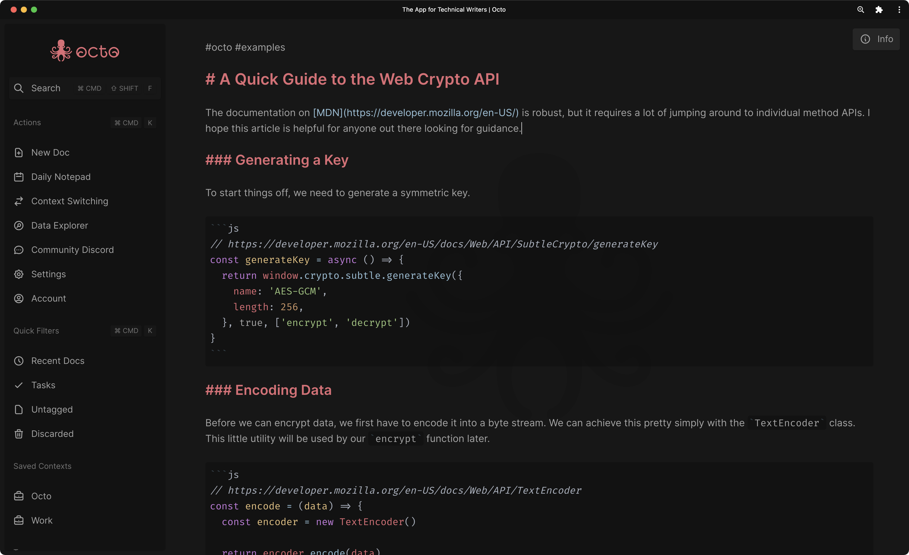

  

The Notes App for Knowledge Workers

## Features

- [x] Dark and light themes
- [x] Hybrid plain-text Markdown rendering
- [x] Syntax highlighting for many common languages (in code blocks)
- [x] Client-side (end-to-end) encryption support
- [x] Cross-platform (desktop and mobile)
- [x] Offline-first progressive web app
- [x] Regex full-text search
- [x] Tag-based file organization
- [x] Drag-and-drop or paste to upload files
- [x] Keyboard shortcuts
- [x] Context switching
- [x] Modern technologies
- [x] Vim Mode support

## Questions

For questions or support, please join our [Discord Community](https://link.octo.app/discord).

## Contributions

Please read the [Contributing Guide](https://github.com/writewithocto/octo/blob/main/CONTRIBUTING.md) and the [Code of Conduct](https://github.com/writewithocto/octo/blob/main/CODE_OF_CONDUCT.md) before making a Pull Request.

## Supporting Octo

Your support is appreciated. Here are some ways you can help. ♥️

### Tell us what you think

Your feedback is immensely important for building octo into an app that we all love. Consider [starting a discussion](https://github.com/writewithocto/octo/discussions) if you have a question or just want to chat about ideas!

### Subscribe to Octo Pro

[Octo Pro](https://octo.app/account) is the official paid subscription plan on [octo.app](https://octo.app).

### Become a financial backer

- [GitHub Sponsors](https://github.com/sponsors/voraciousdev)
- [Patreon](https://patreon.com/voraciousdev)
- [Ko-Fi](https://ko-fi.com/voraciousdev)
- [Buy Me a Coffee](https://www.buymeacoffee.com/voraciousdev)
