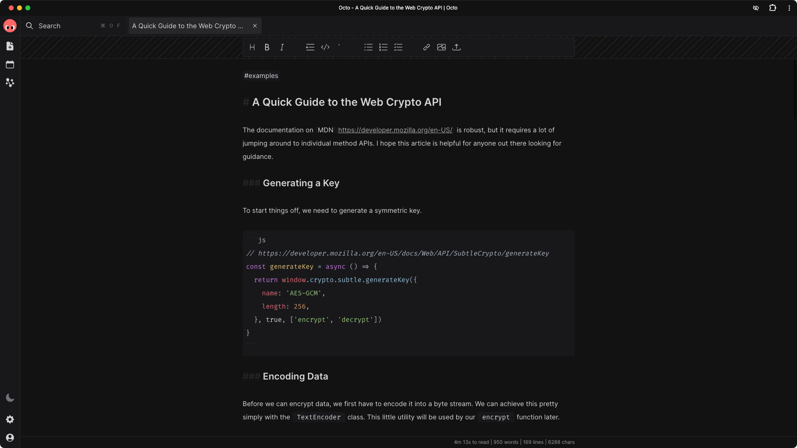

# Octo

Unlock the full potential of your accumulated knowledge. Sign up at [octo.app](https://octo.app).

<a href="https://octo.app">
  <picture>
    <source media="(prefers-color-scheme: dark)" srcset="assets/screenshot-dark.png">
    <source media="(prefers-color-scheme: light)" srcset="assets/screenshot-light.png">
    
  </picture>
</a>

## Features

- [x] Dark and light themes
- [x] Plain-text docs with hybrid rendering
- [x] Automatic syntax highlighting for code blocks
- [x] Keyboard navigation and shortcuts
- [x] End-to-End Encryption (E2EE) support
- [x] Cross-platform and offline-first web app
- [x] Full-text exact match or regex search
- [x] Organize your docs with plain-text hashtags
- [x] Drag-and-drop or paste file attachments
- [x] Workspaces for high-level organization
- [x] Optional Vim Mode editing
- [x] Tabs for recent docs

## Contributions

Please read the [Contributing Guide](https://github.com/davidmyersdev/octo/blob/main/CONTRIBUTING.md) and the [Code of Conduct](https://voracious.link/code-of-conduct) before making a Pull Request.

## Supporting Octo

Your support is appreciated. Here are some ways you can help. ♥️

### Tell us what you think

Your feedback is immensely important for building octo into an app that we all love. Consider [starting a discussion](https://github.com/davidmyersdev/octo/discussions) if you have a question or just want to chat about ideas!

### Become a financial backer

- [GitHub Sponsors](https://github.com/sponsors/davidmyersdev)
- [Open Collective](https://opencollective.com/davidmyersdev)
- [Patreon](https://patreon.com/davidmyersdev)
- [Ko-Fi](https://ko-fi.com/davidmyersdev)
- [Buy Me a Coffee](https://www.buymeacoffee.com/davidmyersdev)
