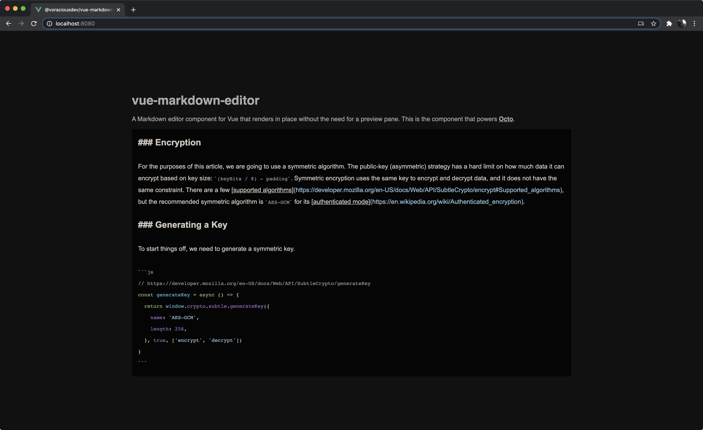

# vue-markdown-editor

A Markdown editor component for Vue that renders in place without the need for a preview pane. This is the component that powers [Octo](https://github.com/voraciousdev/octo).



Check out a quick demo [on YouTube](https://youtu.be/LfhkoCAK6aA).

## Features

### Dark Theme

Works great with dark themes. Light theme coming soon! 😎

### Inline Markdown Rendering

All Markdown formatting is rendered in place. This eliminates the need for a preview pane while keeping your document in plain text. Feel free to copy and paste your Markdown into or out of this editor!

### Automatic Syntax Highlighting

Code blocks are automatically highlighted based on the tagged language.

## Install and Use

### Install

```shell
npm install --save @voraciousdev/vue-markdown-editor
```

### Use

```vue
<template>
  <MarkdownEditor v-model="markdown" />
</template>

<script>
import MarkdownEditor from '@voraciousdev/vue-markdown-editor'

export default {
  name: 'App',
  components: {
    MarkdownEditor,
  },
  data() {
    return {
      markdown: '# Hello, World!'
    }
  },
}
</script>
```

## Contribute

This library uses `yarn`.

### Install dependencies

```shell
yarn install
```

### Compile and hot-reload for development

```shell
yarn serve
```

### Compile for production

```shell
yarn build
```

### Run the unit tests

```shell
yarn test:unit
```

### Lint and fix files

```shell
yarn lint
```
